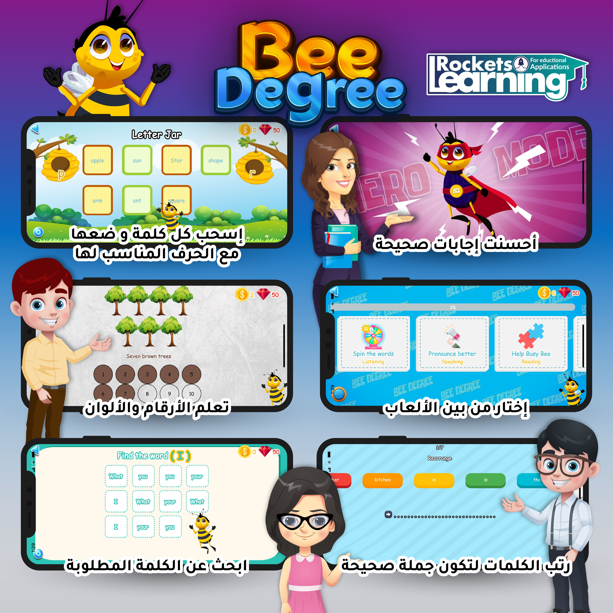

# Bee Degree - Primary 1 [🔗](https://play.google.com/store/apps/details?id=com.learningrockets.bee_degree)

## Credits

Application owned by [Learning Rockets](https://web.facebook.com/BeeDegree2).

Download from Google Play [🔗](https://play.google.com/store/apps/details?id=com.learningrockets.bee_degree)

## Overview

Mobile Application designed for KG and elementary children. It makes learning English more exciting and delightful through developing the main four skills of learning; listening, reading, speaking and writing. Our content is presented through interesting videos that develop the link between eye and ear, lovely games which allow them to practice what they have learned and sweet songs to enjoy.

It is perfectly and easily used by teachers as well as parents and children at school or at home. Students' progress can easily be measured by assignments, quizzes and tests. They also enjoy their time as they interact with games, songs, and sentences.

## Application Features

- More than 20 games for developing the main four skills of learning.
- Classrooms that can teacher create to track students performance.
- Listening, Reading, Speaking, and Writing Tests in each lesson.
- Parents can track their students performance.

## Screens

|                          |                          |
| ------------------------ | :----------------------: |
|  |  |

|                          |                          |
| ------------------------ | :----------------------: |
|  |  |

|                          |                          |
| ------------------------ | :----------------------: |
|  |  |

|                          |                          |
| ------------------------ | :----------------------: |
|  |  |

Hopefully you find our app useful as well as enjoyable.
